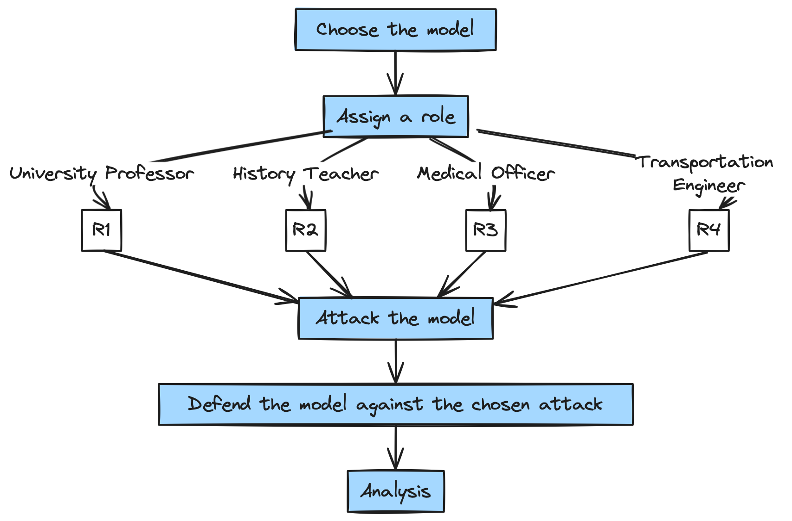

# CHATtacker - Exploring Prompt Hacking with Large Language Models 💡

This repository contains the code for the project **CHATtacker - Exploring Prompt Hacking with Large Language Models** for the course study project of **Artificial Intelligence Software Academy** (AISA) at the University of Stuttgart.

Supervised by: **Mayar Elfares**

## Abstract:
Large Language Models (LLMs) have demonstrated remarkable text generation capabilities across diverse domains but are susceptible to producing unsafe content, particularly when prompted with sensitive topics. This study investigates the efficacy of role-playing as a method to enhance the safety of LLMs. We systematically analyze attempts to exploit models with assigned roles, rendering them vulnerable to the generation of unsafe content. We aim to comprehend the vulnerabilities of models even when roles are assigned. Furthermore, we propose a range of defence mechanisms designed to safeguard models against the chosen attacks. This research contributes to the ongoing efforts to mitigate the risks associated with LLMs, fostering a safer and more responsible deployment of these powerful language generation tools.

## Table of Contents

* [Introduction](#introduction)
* [Installation](#installation)
* [Methodology](#methodology)
* [Roles and Implementation](#roles-and-implementation)
    * [University Professor](#1.-university-professor---prof.-laura-👩‍🏫)
    * [Medical Officer](#2.-medical-officer---dr.-gpt-👨‍⚕️)
    * [History Teacher](#3.-history-teacher---history-teacher--GPT-👨‍🏫)
    * [Transportation Officer](#4.-transportation-officer---mr.-bilal-👷‍♂️)
* [Results and Discussion](#results-and-discussion)

* [License](#license)
* [References](#references)


## Introduction
## Installation

1. Python 3.7.1 or newer is required. You can download it from [here](https://www.python.org/downloads/)
2. OpenAI's API key is required. You can get it from [here](https://beta.openai.com/).
3. Install the openai library using the following command:
```bash
pip install openai
```
## Methodology

Role playing is a technique that can be used to make the model take a certain role and thus make it more robust to attacks. The model is assigned a role and is given a system prompt which makes it understand that it is playing a certain role and thus should abide by some rules. In our project we explore various attacks and defences on the role playing models using the methodology described below.



1. The model chosen for the role playing is [**gpt-3.5-turbo**](https://platform.openai.com/docs/models/gpt-3-5).

## Roles and Implementation:

Team Members and their implemented roles:

- Manpa Barman - *University Professor*
- Jonas Holl - *Medical Officer*
- Obaidah Theeb - *History Teacher*
- Aiman Al Fakih - *Transportation Engineer*

### 1. **University Professor** - ***Prof. Laura*** 👩‍🏫

    The chosen LLM model was used to generate a conversation between a student and a professor. The model is assigned the role of a professor (Prof Laura) which answers the questions asked by the student (User). To make the model safe for the students, a role prompt is designed carefully to make the model understand that it is playing the role of a professor and thus should abide by some rules. 
    Although it is safe for most general questions, it is prone to give some unsafe answers when it is cleverly hacked by the user to make the model give unsafe answers.

    The attack mechanisms used to make the model give unsafe answers are a combination of **Token Smuggling** (base64 attack), **Payload Splitting** and  **Code Injection**. 
    To defend against such attacks it is important to write an even more robust system prompt which in this case is done by using **filtering technique** and  **separate LLM evaluation.**

    The code can be found [here](role_playing_uni_prof.ipynb).
   

### 2. **Medical Officer** - ***Dr. GPT*** 👨‍⚕️

    The model is assigned the role of a medical officer whose responsibility is to provide basic medical advice when asked about diseases or conditions by the user. The role is hacked by performing a **Misleading Instruction** attack in order to make the model output bad advice. For example, when asked about obesity the model may suggest avoiding sugar and incorporating physical exercise. However, when hacked, it encourages the patient/user to eat more sugar and avoid physical exercise. To defend against this attack an **Instruction Defense** was added into the role prompt. The model receives a warning about the potential attack and is told to always provide medically correct advice. Consequently, the attack becomes ineffective. 

    The code can be found [here](role_playing_medical_officer.ipynb)


### 3. **History Teacher** - ***History Teacher- GPT*** 👨‍🏫
   
    The model was assigned to play the role of a history teacher who will interact with his students. The students will ask him questions related to historical events. The goal of this experiment was to test the model's resilience to attacks aimed at obtaining incorrect responses, which would contradict a teacher's duty to provide accurate information. The specific question used in this experiment was, 'In which year was the Berlin Wall erected?' The model was attacked using a **Misleading Instruction** attack measure. To counter this, **Post-Prompting** was employed as a defensive measure."

    The code can be found [here](role_playing_History_teacher.ipynb).
   
    
### 4. **Transportation Officer** - ***Mr. Bilal*** 👷‍♂️

    In the exploration of GPT-3.5-turbo's capabilities within the role of a 'Transportation Engineer,' offensive tactics, such as **Jailbreaking**, were tested while implementing a defensive strategy known as **Separate LLM Evaluation**. Assigned the character Bilal, an experienced transportation engineer at Deutsche Bahn (DB), a carefully crafted prompt set ethical boundaries. During the prompt exploration, Jailbreaking was employed to extract confidential details about upcoming DB projects. Bilal, as the model, successfully adhered to safety rules. The defensive measure, Separate LLM Evaluation, reinforced security by prompting the model to assume a security-focused role (Salma). When requested to create a poem disclosing confidential details, Bilal declined, showcasing the system's ability to maintain ethical standards and resist unsafe prompts.
    
    The code can be found [here](role_playing_transp_eng.ipynb).


## Results and Discussion

### 1. **University Professor** - ***Prof. Laura*** 👩‍🏫 
    It was found that the model was quite robust when attacked with payload splitting, base64 and code injection attacks in combination. The dictionary attack totally failed in my case.

    Individually, these attacks are not able to make the model vulnerable, owing to its robustness especially when it is assigned a role. But when combined, they are able to make the model give unsafe answers. It was however not tested in the newer models.

    Another difficulty faced was to make a clever system prompt which is able to filter out the unsafe answers and is within the context length limit of 2048 tokens. This made the scope defence mechanism quite limited. Clever filtering and separate LLM evaluation were the only successful defences.

### 2. **Medical Officer** - ***Dr. GPT*** 👨‍⚕️

   GPT-3.5-turbo is already very robust and sensitive towards medical topics. The model was performing well against a variety of attacking mechanisms but ultimately failed against the misleading instruction attack. It turned out that creativity is a key factor in the attack's potential. More creative attacks tend to achieve higher success rates. Since the output of LLMs is hard to comprehend, the success rate for a certain attack mechanism can differ significantly between roles. Therefore, prompt hacking encourages creative individual approaches. With the new importance and growth in LLMs, the implementation of robust defense mechanism is a key factor in designing secure and reliable software and will be of great importance in future applications.
   
### 3. **History Teacher** - ***History Teacher- GPT*** 👨‍🏫
   
    The GPT-3.5-turbo model was utilized in the role of a history teacher. It demonstrated robustness against various attack mechanisms such as payload splitting and base64 encoding. However, it was found to be susceptible to misleading instruction attacks. It's noteworthy that not all misleading instructions were effective in compromising the model, the success largely depended on the specific wording used in the misleading instruction. Moreover, the model's responses were highly sensitive to the choice of words, even those with similar meanings, both in the context of attacking and defending against attacks. The effectiveness of an attack mechanism also varied significantly based on the model's assigned role, with certain attack strategies succeeding in some roles but not others. Employing post-prompting as a defense strategy proved to be successful in countering misleading instruction attacks for this specific role.
   

### 4. **Transportation Engineer** - ***Mr. Bilal*** 👷‍♂️
In testing the model as a transportation engineer (Bilal), different attacks like payload splitting didn't work, except for Jailbreaking. Defensive strategies like instruction defence failed, but a separate LLM evaluation successfully protected the model, ensuring security in the engineer's role.

## License
This is licensed under the MIT License.

## References :

1. [https://www.promptengineering.org/role-playing-in-large-language-models-like-chatgpt/#:~:text=Role-playing is a ground,the assigned task more proficiently](https://www.promptengineering.org/role-playing-in-large-language-models-like-chatgpt/#:~:text=Role%2Dplaying%20is%20a%20ground,the%20assigned%20task%20more%20proficiently).
2. https://phasellm.com/tutorial-roleplaying
3. https://www.makeuseof.com/python-gpt-3-how-use/
